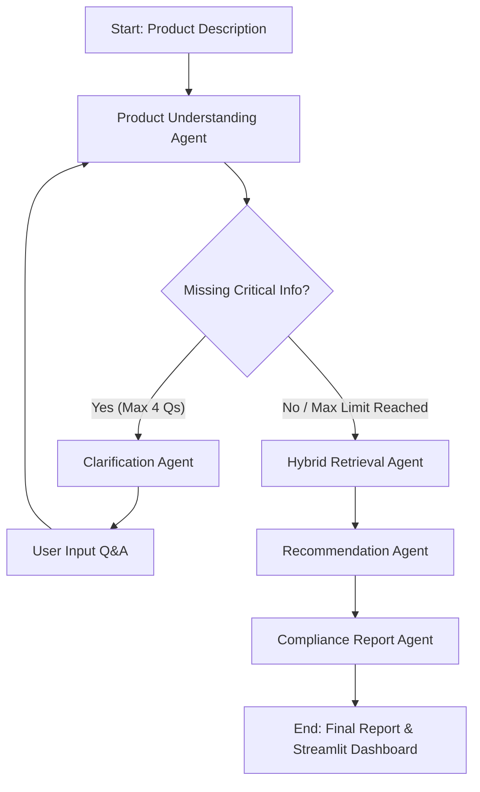

# 🇮🇳 BIS Product Compliance Advisor Agent — Hackathon MVP

An AI-powered compliance assistant designed for Indian manufacturers to quickly identify relevant **Bureau of Indian Standards (BIS)** standards for their products. Built with **LangGraph**, **Pydantic**, **Hybrid Retrieval**, and **Streamlit**.

---

## 🚀 Problem Statement

Navigating Bureau of Indian Standards (BIS) regulations (such as ISI Mark specifications and Compulsory Registration Scheme - CRS) can be overwhelming for Indian small-to-medium manufacturers. This agent streamlines preliminary compliance discovery by:
1. Extracting structured product attributes from plain text descriptions.
2. Asking domain-specific clarification questions (up to a maximum of 4 questions).
3. Searching an authentic local dataset of 30+ official BIS standards using hybrid keyword + semantic similarity retrieval.
4. Explaining recommendations with explicit attribute match evidence ("Why this standard?") and exclusion rationale ("Why not selected?").
5. Generating a structured compliance assessment report with next steps and official BIS source links.

---

## 🏗️ Architecture & Agent Workflow



### Agents Overview
- **Product Agent**: Parses unstructured product text into Pydantic models (`ProductInfo`).
- **Clarification Agent**: Asks targeted, category-aware questions (e.g., electric vs non-electric, age group, direct food contact).
- **Retrieval Agent**: Hybrid vector + exact token search over `data/bis_standards.json`.
- **Recommendation Agent**: Ranks candidates, builds match evidence, and provides negative exclusion logic ("Why not selected?").
- **Report Agent**: Compiles formatted markdown report with next steps and legal disclaimers.

---

## 🛠️ Tech Stack

- **Python**: 3.11+
- **Agent Orchestration**: LangGraph
- **Data Validation & Schemas**: Pydantic v2
- **Vector & Keyword Retrieval**: Hybrid search (`sentence-transformers` + exact field token scoring)
- **Frontend**: Streamlit (with modern dark theme and live agent activity timeline)
- **LLM Abstraction**: OpenAI / Gemini API support with zero-crash deterministic fallback engine

---

## ⚡ Quickstart & Installation

### 1. Set Up Environment & Install Dependencies

```bash
pip install -r requirements.txt
```

### 2. Set Up Environment Variables (Optional)

```bash
cp .env.example .env
```
*(If no API key is provided, the agent runs seamlessly using its built-in high-precision heuristic engine).*

### 3. Run the Streamlit Application

```bash
streamlit run app.py
```

---

## 🎯 Sample Demo Flow Examples

1. **Toys**:
   - *Input*: `I manufacture plastic puzzles for children.`
   - *Clarification*: `Is the product electric or non-electric?`
   - *Result*: Matches `IS 9873 Part 1` (Safety of Toys: Mechanical and Physical Properties).

2. **Electronics**:
   - *Input*: `I manufacture an electronic appliance for home use.`
   - *Clarification*: Power source, rated voltage, device type.
   - *Result*: Matches `IS 302 Part 1` / `IS 13252 Part 1`.

3. **Textiles**:
   - *Input*: `I manufacture cotton garments.`
   - *Result*: Matches `IS 1969 Part 1` / `IS 17565` (Medical/Tensile specifications).

4. **Food Packaging**:
   - *Input*: `I manufacture plastic containers used for food.`
   - *Clarification*: Direct food contact and plastic resin type (PE / PP / PET).
   - *Result*: Matches `IS 10146` / `IS 16738` / `IS 10141`.

---

## 🔒 Security & Guidelines

- Zero hallucinated standard codes: All recommended standards originate strictly from the curated local dataset (`data/bis_standards.json`).
- Environment variables managed via `python-dotenv` without hardcoded secrets.

---

## ⚠️ Important Legal Disclaimer

*This assessment is an AI-assisted preliminary evaluation prototype built for hackathon demonstration purposes. Manufacturers must verify current official BIS requirements, technical scopes, and testing regulations with certified BIS auditors before relying on this assessment.*
